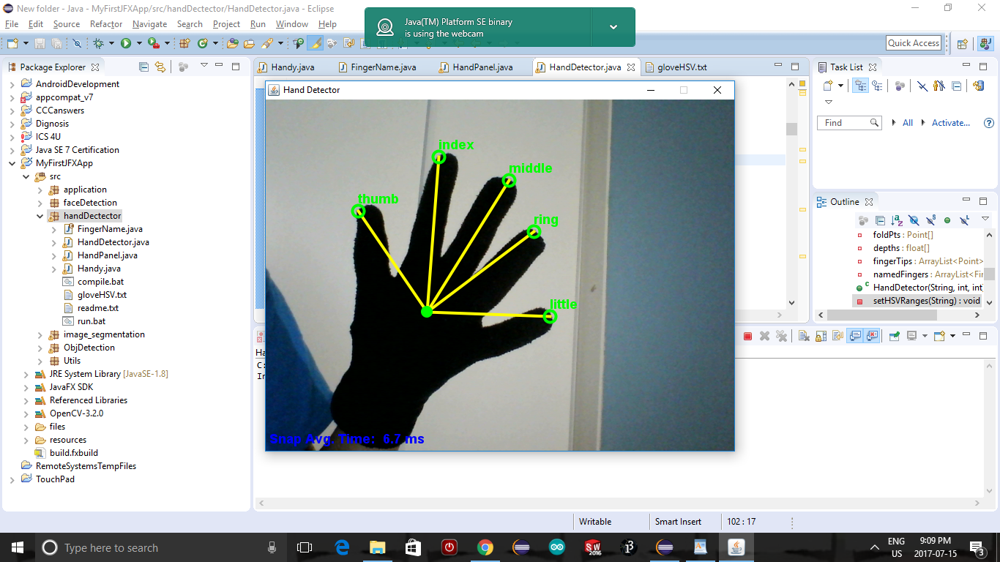

# HandMovement_Mimic Continuation of MakeUofT

This project is currently under development and currently requires major changes to the image processing code. Majority of the code is written in Java and C++. 

The robot hand has been constructed using servo motors and is controlled using the Arduino. Ports are controlled through after recognition of gesture.

# Setup : 

Eclipse (Maven recommended)
- Use Maven to add JAVACV, JAVACPP, OPENCV to libraries folder (may encounter problems with jni_opencv.dll during installation).
- When running the file, JavaFX must be installed to run the .bat file.

Arduino : 
- Setup is easy. Compile the code and run the code with particular port connection in Eclipse.

Esentially the code analyzes an image containing an HSV hand. Find the largest contour, its convex hull, and convexity defects. Extract finger tips from the defects and, by assuming that it is a left hand, label the fingers.

